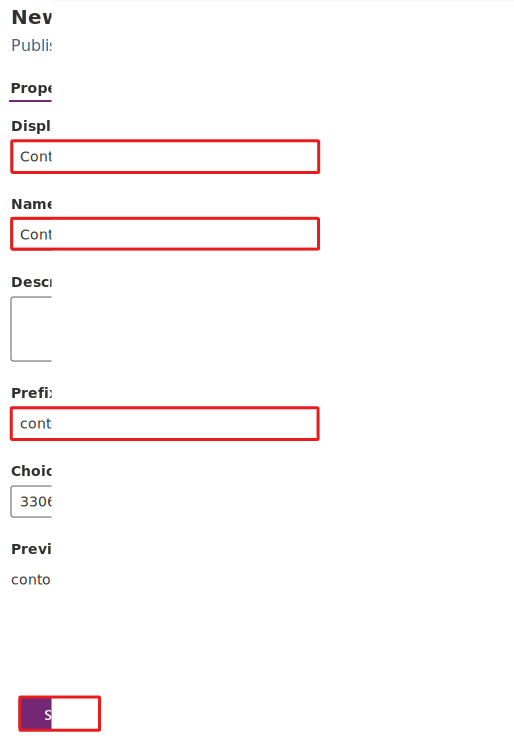
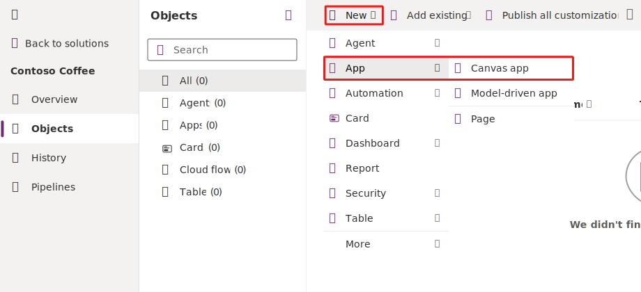

# App In a Day Environment Validation 

## Section 1: Create a new solution
--------------------------------

In this task, you create a new solution and a publisher. The solution will contain and track all your work.

1. Select **Solutions > + New solution**.

    

2. Enter `Contoso Coffee` for the **Display name** and then select the **\+ New publisher** button.

    

3. Enter `Contoso` as the **Display name**, `Contoso` as the **Name**, and `contoso` for **Prefix**. Select **Save**.

    

4. Select the **Contoso** publisher that you created for **Publisher** and then select **Create**.

    

5. Select the **Contoso Coffee** solution that you created.

6. Don't navigate away from this page.

## Section 2: Create a new application
-----------------------------------

In this task, you create a new application by following these steps:

1. Make sure that you're in the **Contoso Coffee** solution.

2. Select **\+ New** and then select **App > Canvas app**.

    

3. Enter `Machine Ordering App` in the **App name** field, select the **Tablet** option under **Format**, and then select **Create**.

    

4. If prompted, select your region and then select **Get started**.

5. Select **Skip** if you receive the **Welcome to Power Apps Studio** prompt.

## Section 3: Create a custom table

In this task, you create a custom table to store machine order requests.

1. Select **Solutions** and then open the **Contoso Coffee** solution.

2. Select the **\+ New** drop down from the tool bar at the top of the page, hover over the **Table** option and then choose **Table (advanced properties)**.

    

3. Enter `Machine Order` in the **Display name** field. The **Plural name** field automatically populates based on your entry in the **Display name** field. These fields are editable if you need to make changes. The system uses the plural name by default whenever a set of rows are shown.

    Select the **Enable attachments** option because it allows you to create notes on the machine order.

    

4. Select the **Primary column** tab.

5. Change the **Display name** field to `Machine Name`. The **Primary** column defaults to being named **Name**. For some scenarios, that label might not be the best one, so you can customize it if needed. However, the **Primary** column is always a text column that isn't changeable.

6. Select **Save**.

    

## Section 4: Sign in to the Power Automate website

1. Go to [Power Automate](https://flow.microsoft.com/) and make sure that you're in the **correct environment** where you have been building your apps for these labs.

2. Select **Solutions** and then select to open the **Contoso Coffee** solution.

3. Select **\+ New** and then select **Automation** > **Cloud flow** > **Automated**.

    